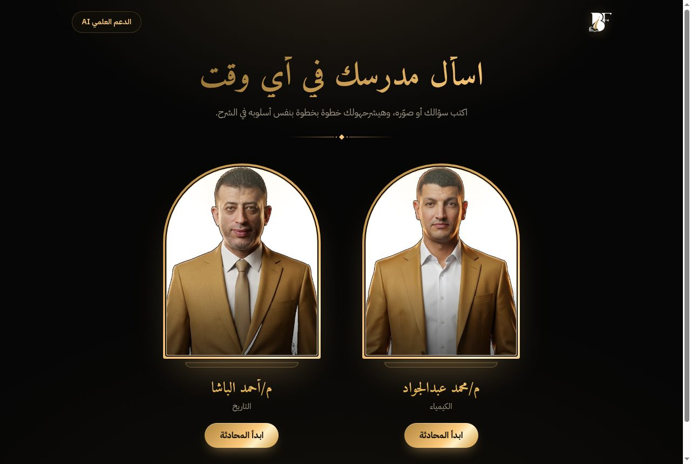
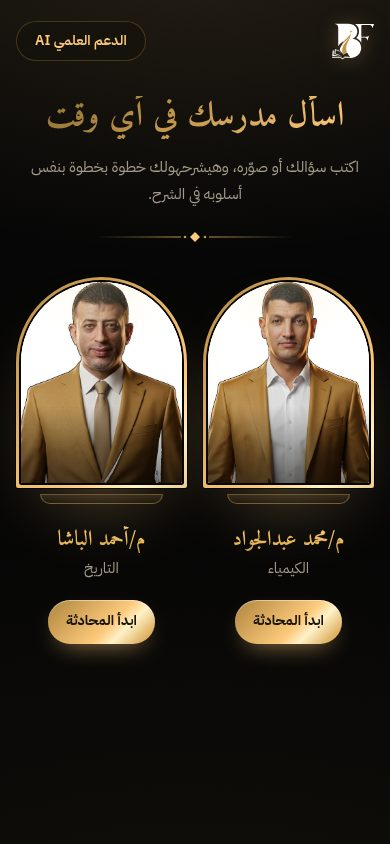
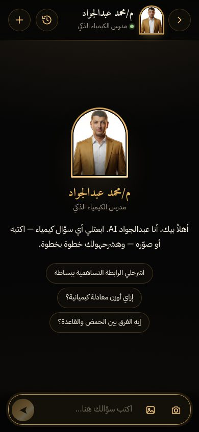
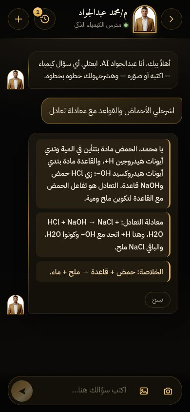

# الدعم العلمي AI — دليل الربط لمنصة Be First

واجهة جاهزة لمدرسين الـ AI: **م/محمد عبدالجواد (الكيمياء)** و**م/أحمد الباشا (التاريخ)**.
الـ AI نفسه شغال على سيرفرنا — إنتوا بس بتعرضوا الواجهة وبتبعتوا بيانات الطالب.

- **النسخة الشغالة دلوقتي:** https://aiservice.magacademy.co/befirst-ai/
- **الـ API:** `https://aiservice.magacademy.co` (مفتوح CORS لأي دومين، مش محتاج مفاتيح)



<p>
  
  
  
</p>

---

## ⚡ الخلاصة في 30 ثانية

ضيفوا تاب في المنصة اسمه **"الدعم العلمي AI"** يفتح الرابط ده ببيانات الطالب اللي عامل تسجيل دخول:

```
https://aiservice.magacademy.co/befirst-ai/?student_id=<ID>&student_name=<الاسم>&grade_name=<الصف>
```

خلاص كده. كل حاجة تانية (الشات، الصور، الكاميرا، الرسومات) شغالة جوه.

> ⚠️ **مهم — تقسيم المسؤولية:**
> - **علينا إحنا:** الـ AI نفسه — الإجابة، وسياق المحادثة (`notebook_id`)، وحساب المحادثات لكل مدرس.
> - **عليكم إنتوا:** **تخزين محادثات كل طالب عندكم، وعرضها، واسترجاعها.** سجل "المحادثات السابقة"
>   اللي في الصفحة الجاهزة ديمو بس (محفوظ في متصفح الطالب) — مش تخزين دائم ومش مضمون.
>   شوفوا القسم (5) تحت لشكل التخزين المقترح.

---

## 1) بيانات الطالب اللي الـ AI محتاجها

| الحقل | مطلوب؟ | مثال | الـ AI بيعمل بيه إيه |
|---|---|---|---|
| `student_id` | **أيوه** | `48213` | المعرّف الثابت للطالب عندكم. بيربط أسئلة الطالب ببعض (ذاكرة الطالب في الكيمياء)، وبيفصل محادثات كل طالب عن التاني في سجل المحادثات. **لازم يبقى ثابت ومايتغيرش** — استخدموا الـ id من الداتابيز، مش الإيميل ولا رقم الموبايل. |
| `student_name` | يُفضّل | `محمد علي` | الـ AI بينادي الطالب باسمه الأول مرة واحدة في المحادثة ("يا محمد"). من غيره بيرد عادي من غير اسم. |
| `grade_name` | **مهم جدًا** | `2 ثانوي \| بكالوريا` | الـ AI بيظبط مستوى الشرح والمنهج على الصف ده. ابعتوه بنفس اسم الصف اللي عندكم (زي ما بيظهر للطالب). |
| `user_email` | اختياري | `m@x.com` | مش ضروري. لو اتبعت، المحادثة بتتربط بحساب الطالب في نظامنا كمان. |

> 🔒 **خصوصية:** مش محتاجين رقم موبايل ولا رقم قومي ولا أي بيانات تانية. البيانات دي بتتخزن مع المحادثة على سيرفرنا عشان المتابعة وتحسين الردود.

---

## 2) طرق الربط — اختاروا واحدة

### الطريقة (أ): تاب بيفتح الصفحة الجاهزة ← **الأسهل (من غير أي كود تقريبًا)**

#### أ-1: لينك عادي (صفحة جديدة أو نفس الصفحة)
```js
// 🔌 بيانات الطالب اللي عامل login عندكم
const url = new URL("https://aiservice.magacademy.co/befirst-ai/");
url.searchParams.set("student_id", user.id);
url.searchParams.set("student_name", user.name);
url.searchParams.set("grade_name", user.grade_name);
window.location.href = url.toString();   // أو window.open(url, "_blank")
```

#### أ-2: جوه صفحة عندكم (iframe) — الطالب مايخرجش من المنصة
```html
<iframe
  src="https://aiservice.magacademy.co/befirst-ai/?student_id=48213&student_name=محمد%20علي&grade_name=2%20ثانوي"
  allow="camera; clipboard-write"
  style="width:100%; height:100vh; border:0;"
  title="الدعم العلمي AI"></iframe>
```
⚠️ **`allow="camera"` ضروري** — من غيره زرار التصوير مش هيفتح الكاميرا جوه الصفحة (هيفتح كاميرا الموبايل كبديل).

**مثال Vue جاهز:** `examples/AiSupportTab.vue` — حطوه كـ route/تاب في المنصة.

#### روابط مباشرة لمدرس معيّن (اختياري)
| الرابط | بيفتح |
|---|---|
| `.../befirst-ai/?...` | شاشة اختيار المدرس |
| `.../befirst-ai/?...#jawad` | آخر محادثة مع عبدالجواد (أو جديدة لو مفيش) |
| `.../befirst-ai/?...#elbasha` | آخر محادثة مع الباشا |
| `.../befirst-ai/?...#jawad/new` | محادثة جديدة مع عبدالجواد |

مثلًا: زرار "اسأل عبدالجواد AI" جوه صفحة كورس الكيمياء يفتح `#jawad` على طول.

#### بيانات الطالب من غير ما تبان في الرابط (اختياري)
لو مش عايزين البيانات في الـ URL، افتحوا الـ iframe من غيرها وابعتوها بعد ما يحمّل:
```js
iframe.addEventListener("load", () => {
  iframe.contentWindow.postMessage(
    { type: "befirst-ai:student", student_id: user.id, student_name: user.name, grade_name: user.grade_name },
    "https://aiservice.magacademy.co"
  );
});
```

---

### الطريقة (ب): تبنوا الواجهة بنفسكم جوه المنصة وتكلموا الـ API مباشرة

لو عايزين الشات يبقى component من الكود بتاعكم (Vue/Vuetify)، استخدموا الـ API ده.
مثال كامل شغال: **`examples/api-example.js`**.

#### إرسال سؤال (رد streaming)
```
POST https://aiservice.magacademy.co/ask-by-question-id-chemistry-stream   ← عبدالجواد (كيمياء)
POST https://aiservice.magacademy.co/ask-by-question-id-history-stream     ← الباشا (تاريخ)
Content-Type: multipart/form-data
```

| الحقل | النوع | ملاحظات |
|---|---|---|
| `question` | نص | نص السؤال. لو الطالب بعت صورة بس، ابعتوا `"جاوب على الصورة"`. |
| `image` | ملف | اختياري. صورة السؤال (jpg/png/webp)، **أقصى حجم 10MB** — يُفضّل تصغيرها لـ 1600px قبل الرفع. |
| `notebook_id` | نص | **فاضي في أول سؤال**. السيرفر بيرجّعه في أول event — ابعتوه مع كل سؤال بعد كده في نفس المحادثة عشان الـ AI يفتكر الكلام اللي فات. |
| `student_id` / `student_name` / `grade_name` / `user_email` | نص | نفس الجدول في (1). |
| `reply_to_ts` | نص | اختياري. **ريبلاي على رسالة قديمة** (زي واتساب): الـ `user_ts` أو `bot_ts` بتاع الرسالة اللي الطالب بيرد عليها (التفاصيل تحت). |

#### شكل الرد (Server-Sent Events)
الرد بيوصل سطر سطر بالشكل ده:
```
data: {"notebook_id":"q_1791288533612_9uco8"}      ← أول event: احفظوه للمحادثة دي
data: {"user_ts":"2026-10-09T15:46:10.214Z","reply_to":null}   ← id رسالة الطالب (+ الاقتباس لو كانت ريبلاي)
data: {"chunk":"🔹 يا محمد، الحمض مادة "}           ← أجزاء الرد، ضمّوها لبعض بالترتيب
data: {"chunk":"بتدي أيونات H+ ..."}
data: {"bot_ts":"2026-10-09T15:46:13.002Z"}         ← id رد المدرس (بييجي قبل [DONE] لما الرد يتحفظ)
data: {"error":"..."}                               ← لو حصلت مشكلة (اعرضوا رسالة + زرار "جرّب تاني")
data: [DONE]                                        ← خلص
```
- `EventSource` **مش هينفع** (لإنه GET بس) — استخدموا `fetch` واقروا `response.body` (المثال فيه ده جاهز).
- **الرسومات التوضيحية:** أثناء الرد هيظهر نص `*(جاري تحضير الرسم التوضيحي...)*`، وفي آخر الرد بييجي ``. لما الـ `` يوصل، شيلوا نص "جاري التحضير".
- **التنسيق:** الرد نص فيه علامات تنسيق خاصة (🔹 كارت علمي، 💡 الخلاصة، 🎭 هزار، `**عريض**`، قوايم متداخلة، جداول، معادلات بـ →). **استخدموا نفس الملفات اللي معانا عشان يتعرض صح:**
  ```js
  html = DOMPurify.sanitize(formatMessage(enhanceMessage(text)));   // formatMessage.js + enhanceMessage.js + chatFormatter.css
  ```
  ولفّوا الناتج في `<div class="custom-message-content">`.
- **التلوين الذكي (اختياري ومنصوح بيه):** بعد ما تحطوا الـ HTML في الصفحة، نادوا `highlightMessage` على نفس العنصر عشان
  الكلام المهم يبرز بألوان حسب المعنى: صيغ كيميائية (H₂SO₄، SO₄²⁻) وتوزيع إلكتروني (3d¹⁰)، أرقام بوحداتها
  (2 mol، 25°C)، سنين وتواريخ (28 فبراير 1922)، كلمات زي "الإجابة الصحيحة/الخلاصة/السبب"، حروف الاختيارات، و✅/❌:
  ```js
  el.innerHTML = html;
  highlightMessage(el, "chemistry");   // عبدالجواد = "chemistry" | الباشا = "history"   (highlightMessage.js)
  ```
  الألوان في `styles.css` (قسم "تلوين ذكي")، بالـ classes ‎`.hl-chem` / `.hl-num` / `.hl-date` / `.hl-cue` / `.hl-opt`...
  آمن: بيشتغل على النص بس ومش بيضيف HTML، ولو المتصفح قديم ومش بيدعمه، الرد بيتعرض عادي من غير تلوين.

#### ↩️ الريبلاي على رسالة قديمة (زي واتساب)
الطالب يقدر يختار أي رسالة قديمة في نفس المحادثة (سؤاله أو رد المدرس، نص أو صورة) ويكمل عليها،
والمدرس بيفتكر سياقها من غير ما الطالب يبعت الصورة تاني أو ينسخ الكلام.
1. خزّنوا `user_ts` و`bot_ts` اللي بيرجعوا في الـ SSE مع كل رسالة عندكم — ده الـ id بتاعها عندنا.
2. لما الطالب يعمل ريبلاي، ابعتوا `reply_to_ts` = الـ ts بتاع الرسالة دي مع السؤال الجديد (نفس `notebook_id`).
3. السيرفر **بيجيب الرسالة بنفسه** من نفس المحادثة: نصها، ولو كانت صورة (أو رد على صورة) بيرفق الصورة
   للمدرس تلقائيًا. ماتبعتوش نص الرسالة ولا الصورة تاني.
4. أول event بيرجّع `reply_to` = `{ ts, role: "user"|"assistant", excerpt, has_image }` — خزّنوه مع رسالة
   الطالب واعرضوه كاقتباس فوقها (اسم صاحب الرسالة + `excerpt`، وعند الضغط عليه انزلوا للرسالة الأصلية).
   لو الـ ts مش موجود في المحادثة، السيرفر بيتجاهل الريبلاي بهدوء و`reply_to` بيرجع `null`.

الصفحة الجاهزة (الطريقة أ) فيها ده كامل: زرار رد على كل رسالة، وسحب الرسالة على الموبايل، وشريط
"بترد على" فوق خانة الكتابة.

#### المحادثات القديمة ← **التخزين والعرض عندكم** (القسم 5)
بعد كل سؤال/رد خزّنوهم في الداتابيز بتاعتكم، واعرضوا السجل منها. السيرفر عندنا **مش** مصدر
بيانات الطلاب ليكم، ومش هنقدم عرض/استرجاع لمحادثات الطلاب كخدمة.

الـ endpoint ده موجود للتجربة والدعم الفني بس (لو بعتولنا `notebook_id` محادثة فيها مشكلة) — **ماتبنوش عليه:**
```
GET https://aiservice.magacademy.co/v2/chat/<notebook_id>
```
```json
{
  "notebook_id": "q_1791288533612_9uco8",
  "created_at": "...", "updated_at": "...",
  "chat": [
    { "role": "user",      "text": "إيه الفرق بين الحمض والقاعدة؟", "image": "https://.../question.jpg" | null, "timestamp": "..." },
    { "role": "user",      "text": "مش فاهم", "timestamp": "...", "reply_to": { "ts": "...", "role": "assistant", "excerpt": "...", "has_image": false } },
    { "role": "assistant", "text": "🔹 يا محمد، ...", "images": ["https://.../drawing.webp"], "timestamp": "..." }
  ]
}
```

---

## 3) الملفات

| الملف | إيه هو | لو هتعدّلوا |
|---|---|---|
| `index.html` | الصفحة (شاشة المدرسين + الشات + الكاميرا + سجل المحادثات) | النصوص الثابتة |
| `styles.css` | الشكل — نفس ألوان وخط Be First | الألوان في `:root` أول الملف |
| `app.js` | كل المنطق. **دوّروا على 🔌 — دي كل نقط الربط** | المدرسين في `TEACHERS` |
| `formatMessage.js` + `chatFormatter.css` | تنسيق رسايل المدرسين (نفس اللي في منصتنا بالظبط) | ماتعدّلوش |
| `enhanceMessage.js` | قوايم متداخلة وجداول (مبني على تحليل آلاف الردود الحقيقية) | ماتعدّلوش |
| `highlightMessage.js` | تلوين ذكي للكلام المهم في الرد حسب المادة (صيغ، أرقام بوحداتها، سنين، كلمات مهمة) | ماتعدّلوش (الألوان في `styles.css`) |
| `img/` | صور المدرسين واللوجو (من موقعكم) | — |
| `examples/` | أمثلة الربط: Vue، iframe، API | — |

**مفيش build ولا npm** — HTML/CSS/JS عادي. ممكن ترفعوا الفولدر كله على السيرفر بتاعكم (مثلًا `befirst1.net/ai/`) وهيشتغل زي ما هو، لإنه بيكلم الـ API عندنا مباشرة.
المكتبة الخارجية الوحيدة: DOMPurify (من jsDelivr) + خط IBM Plex Sans Arabic (من Google Fonts).

---

## 4) أسئلة متوقعة

- **الطالب مش عامل login؟** الصفحة شغالة برضو (بتعتبره "guest")، بس المحادثات مش هتتحفظ له على حسابه والـ AI مش هيعرف صفه. **ابعتوا `student_id` و`grade_name` دايمًا.**
- **سجل المحادثات بيتحفظ فين؟** ده **مسؤوليتكم** (القسم 5). في الصفحة الجاهزة هو ديمو في متصفح الطالب بس — بيضيع لو الطالب مسح بيانات المتصفح أو فتح من جهاز تاني.
- **الرد بياخد قد إيه؟** أول كلمة بتظهر في ~3–5 ثواني، والسؤال بالصورة ~15–20 ثانية.
- **عايزين نضيف مدرس تالت؟** كلمونا نجهّز له الـ AI على السيرفر، وبعدها بيتضاف كسطر في `TEACHERS` جوه `app.js`.
- **فيه مشكلة؟** ابعتوا لنا `notebook_id` المحادثة (موجود في الرابط بعد `#jawad/`) ووقت المشكلة.

---

## 5) تخزين محادثات الطلاب عندكم (مسؤوليتكم)

اقتراح لجدولين في الداتابيز بتاعتكم:

```sql
-- محادثة = طالب + مدرس + notebook_id (اللي بيرجع من أول event في أول سؤال)
CREATE TABLE ai_conversations (
  id            BIGSERIAL PRIMARY KEY,
  student_id    BIGINT       NOT NULL,          -- الطالب عندكم
  teacher       VARCHAR(20)  NOT NULL,          -- 'jawad' | 'elbasha'
  notebook_id   VARCHAR(64)  NOT NULL UNIQUE,   -- ابعتوه مع كل سؤال جديد في نفس المحادثة
  title         VARCHAR(120),                   -- أول سؤال (أو "صورة سؤال")
  created_at    TIMESTAMP    NOT NULL DEFAULT now(),
  updated_at    TIMESTAMP    NOT NULL DEFAULT now()
);
CREATE INDEX ON ai_conversations (student_id, teacher, updated_at DESC);

CREATE TABLE ai_messages (
  id               BIGSERIAL PRIMARY KEY,
  conversation_id  BIGINT      NOT NULL REFERENCES ai_conversations(id),
  role             VARCHAR(10) NOT NULL,        -- 'user' | 'assistant'
  text             TEXT,                        -- نص السؤال، أو نص الرد كامل (بعد [DONE])
  image_url        TEXT,                        -- صورة سؤال الطالب (ارفعوها على التخزين بتاعكم)
  created_at       TIMESTAMP   NOT NULL DEFAULT now()
);
```

**الخطوات مع كل سؤال:**
1. الطالب بيبعت → خزّنوا رسالة `user` (والصورة على التخزين بتاعكم).
2. ابعتوا السؤال للـ API (ومعاه `notebook_id` المحادثة لو مش أول سؤال).
3. أول event بيرجّع `notebook_id` → لو محادثة جديدة، اعملوا صف `ai_conversations` بيه.
4. ضمّوا الـ `chunk`s لحد `[DONE]` → خزّنوا رسالة `assistant` بالنص كامل.
   **خزّنوا النص زي ما هو** (فيه علامات التنسيق وروابط الرسومات ``) — واعرضوه وقت الفتح بـ
   `formatMessage(enhanceMessage(text))` عشان يطلع بنفس الشكل.
5. لو رجع `error`: ماتخزنوش رد، واعرضوا "جرّب تاني".

**عرض السجل:** `SELECT ... FROM ai_conversations WHERE student_id = ? AND teacher = ? ORDER BY updated_at DESC`
— ولما الطالب يكمّل محادثة قديمة، ابعتوا نفس `notebook_id` عشان الـ AI يفتكر الكلام اللي فات.

